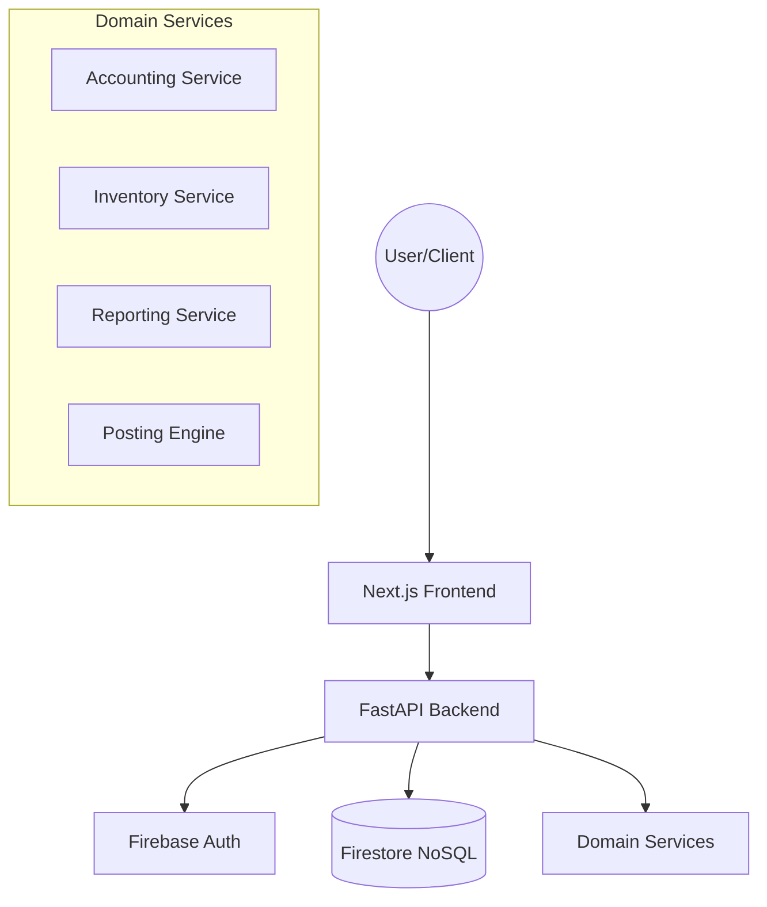

# OpenGate ERP 🚀

OpenGate ERP is a high-performance, modern Enterprise Resource Planning (ERP) system tailored for the Iraqi market, built on a serverless, real-time architecture using **FastAPI**, **Next.js**, and **Firestore**.

---

## 🏗 System Architecture

The project follows a monorepo structure with a clear separation between the frontend (React/Next.js) and the backend (Python/FastAPI).



### 🔐 Multi-Tenant Security Model
We use a **"Shared Cabinet, Locked Drawers"** model:
- **Identifier**: Every record is stamped with a `company_id`.
- **Enforcement**: Backend middleware validates the user's **Firebase Custom Claims** on every request.
- **Isolation**: Users can only read/write data associated with their specific `company_id`.

---

## 📂 Core Modules

### 1. ⚖️ Accounting Module
Built on a high-availability posting engine that ensures atomic transactions.
- **General Ledger**: Real-time transaction tracking with running balances.
- **Chart of Accounts (COA)**: Hierarchical account structure support (Iraqi Standardized COA compatible).
- **Journal Entries**: Balanced double-entry bookkeeping with automated posting.
- **Reporting**: O(1) performance for Balance Sheet, Trial Balance, and Customer Statements (using pre-aggregated balances).

### 2. 📦 Warehouse & Inventory
Manages the end-to-end lifecycle of goods.
- **Product Management**: Support for multi-currency pricing (IQD/USD) and customer-specific associations.
- **Stock Movements**: Inbound (Purchase) and Outbound (Sales) document flows.
- **WAC Valuation**: Weighted Average Cost calculation handled in the background.
- **Bin Cards**: Audit-ready history for every single item movement.

### 3. 📊 Reporting engine
- **Customer Statements**: Detailed debit/credit history with opening/closing balances.
- **Inventory Analytics**: Low stock alerts, valuation summaries, and movement trends.

---

## 🛠 Technical Specifications

### Tech Stack
| Component | Technology | Rationale |
| :--- | :--- | :--- |
| **Frontend** | Next.js 14+ | Server-side rendering & optimized routing. |
| **Backend** | FastAPI | High-performance asynchronous execution. |
| **Database** | Firestore | Serverless NoSQL with real-time listeners. |
| **Styling** | Vanilla CSS/Tailwind | Clean, responsive, and high-performance UI. |
| **Auth** | Firebase Auth | Secure identity management & session handling. |

### Performance Optimizations
- **Pagination**: Implemented server-side pagination (Limit/Offset) for all large datasets (Products, Journals, Intents).
- **In-Memory Sorting**: Used strategically to avoid Firestore composite index overhead during development.
- **Transaction Safety**: All financial/stock updates are wrapped in Firestore Transactions to prevent `ReadAfterWrite` errors.

---

## 🚀 The Good, The Bad, & The Next

### ✅ The Good (What's Done)
- **Real-Time Sync**: Changes reflect across the dashboard instantly.
- **Multi-Currency**: Seamless handling of USD/IQD exchange rates in accounting.
- **High Performance**: Dashboard renders instantly even with hundreds of accounts.
- **Mobile Responsive**: Fully usable on tablets and smartphones.

### ❌ The Bad (Current Constraints)
- **Index Dependencies**: Some complex filtered sorts currently rely on in-memory operations to avoid immediate Firestore index creation.
- **Manual Calibration**: Initial company setup (Company ID claims) currently requires script execution.

### 📈 The Next (Future Improvements)
- **Automated Indexing**: Re-enable server-side sorting for all pages once composite indexes are deployed.
- **Production-Grade Analytics**: Real-time Recharts dashboards for revenue and stock value.
- **Admin Portal**: A dedicated UI for managing tenants, company IDs, and user roles.
- **OCR Integration**: Image/PDF parsing for expense receipts and invoices.

---

## 💻 Local Setup

1. **Backend**:
   ```bash
   cd backend
   pip install -r requirements.txt
   uvicorn app.main:app --reload
   ```
2. **Frontend**:
   ```bash
   cd frontend
   npm install
   npm run dev
   ```

---

## 📄 License & Ownership
**Commercial / Private** - Developed for **hxcsa**.
*Maintained by Antigravity AI.*
