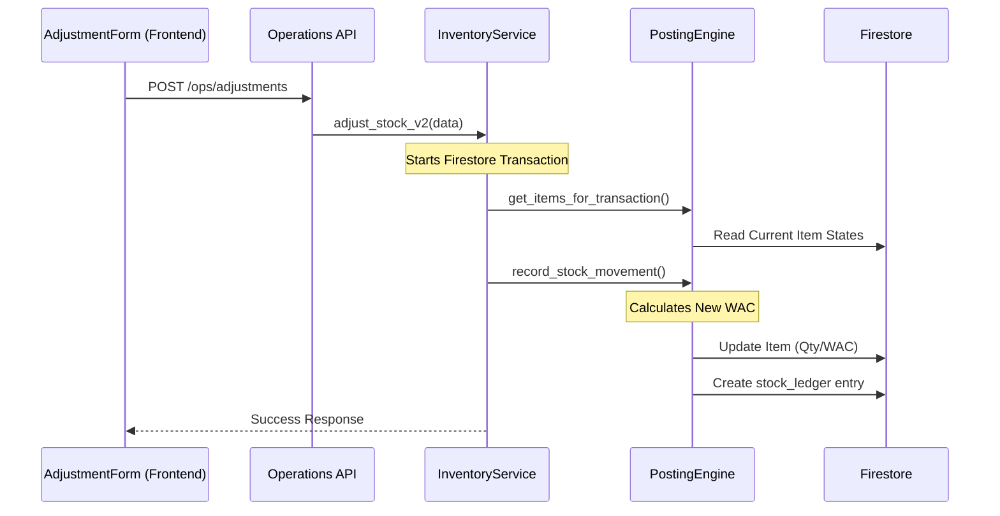

# Warehouse Module Architecture

This document provides a technical overview of the Warehouse module, detailing the flow of data from the frontend to the backend and the underlying database logic.

## 🏗️ System Overview

The warehouse module handles inventory management, including stock levels, movements (transfers/adjustments), and logistics "intents" (GET/GIVE requests).

### 🧩 Core Components

| Component | Responsibility |
| :--- | :--- |
| **Frontend Forms** | `IntentForm`, `AdjustmentForm` - Capture user input and handle basic validation. |
| **API Endpoints** | `warehouse.py`, `intents.py`, `operations.py` - Handle HTTP requests and routing. |
| **Inventory Service** | `inventory.py` - Orchestrates complex stock operations and transactions. |
| **Posting Engine** | `posting.py` - Manages low-level atomic writes to stock ledger and journal entries. |
| **Lifecycle Service** | `lifecycle.py` - Manages document states (DRAFT -> POSTED -> VOIDED). |
| **Firestore** | NoSQL database storing items, stock_ledger, warehouses, and documents. |

---

## 🔄 Data Workflows

### 1. Stock Adjustment / Transfer

### 2. Intents (GET/GIVE Logistics)
- **Status Flow**: `requested` -> `guaranteed` -> `in_warehouse` -> `done`.
- **Logic**: Intents don't affect accounting or real stock until they are converted into a physical movement (GRN or Delivery Note).
- **Frontend Validation**: The `IntentForm` checks current stock levels for "GIVE" intents to prevent requesting unavailable stock.

---

## 📊 Database Schema Details

### `items` Collection
Stores the master product data and global aggregated stock metrics.
- `current_qty`: Current aggregate stock across all warehouses.
- `current_wac`: Weighted Average Cost (used for valuation).
- `total_value`: `current_qty * current_wac`.

### `stock_ledger` Collection
The atomic source of truth for every single movement.
- `quantity`: Positive for IN, Negative for OUT.
- `warehouse_id`: Destination/Source warehouse.
- `valuation_rate`: The WAC at the time of the movement.
- `source_document_id`: Links back to the triggering document (Adjustment, GRN, etc).

---

## 🛡️ Business Logic Rules

1. **WAC Calculation**: Using Weighted Average Cost for all valuation.
   - `New WAC = (Old Total Value + New Purchase Value) / (Old Qty + New Qty)`
2. **Atomic Transactions**: All inventory movements use Firestore `transactions` to ensure consistency.
3. **Draft State**: Documents like Adjustments start as `draft` and must be approved to affect the ledger.
4. **Auto-Add UX**: Forms are configured to auto-add drafted items if the user forgets to click the (+) button, preventing submission errors.
